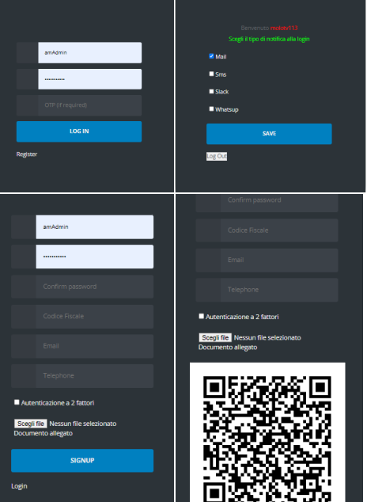

Esempio di applicazione web con autenticazione a due fattori.

Lo stack tecnologico utilizzato è il seguente:

Spring Boot 2.7.7
	Spring Web : per architettura MVC
	Spring Data JPA
	Spring Security
	Spring Thymeleaf : come tecnologia di templating
	Spring Mail : per esempio di configurazione per la notifica delle mail
Java 1.8
MariaDB

La scelta di utilizzare thymeleaf come tecnologia di view/templating ed un approccio MVC/Simil-monolitico (piuttosto che REST/microservizio) deriva dal fatto di 
voler rendere eseguibile e testabile l'applicazione, creando il FE (veramente minimale e basico) con il minimo sforzo, piuttosto
che dover tirare su un webserver (nginx, httpd etc..) per una SPA in angular (sebbene si possa anche prevedere di agganciare la SPA 
in mvn/spring boot, comunque non è questo lo scopo del progetto).

Si utilizza Spring Security, e la form based authentication di questo.
In questo modo è possibile mappare un url sul quale Spring controlla username e password per il tipico controllo a singolo fattore.
Questo è fatto nella classe di configurazione sito.davide.conf.SecurityConf che estende WebSecurityConfigurerAdapter (anche se nelle nuove versioni questo è deprecato 
e sarebbe da preferire il Filter Chain come approccio).
Si tengono ovviamente scoperti gli indirizzi per la registrazione e quelli per le risorse statiche (i css) mentre tutti gli altri url sono coperti da Spring Security
che blocca (e reindirizza alla login page) in caso di mancato utente loggato in sessione (quindi è un approccio ovviamente con sessione).

Come da classico sistema MVC, c'e' un controller sito.davide.api.MainController che fa da dispatcher principale (ritornando i nomi delle pagine html) 
per le chiamate GET verso le risorse (i view template) contenuti sotto resource/templates .
Sempre nel MainController sono inoltre presenti gli endpoint (che rispondono in POST) alla registrazione di un nuovo utente e alla modifica delle preferenze per le notifiche inviate
in fase di login.

Quando un utente logga vengono mostrate le preferenze in merito ai metodi di login scelti.
Salvando le preferenze, al successivo login verranno simulati gli invii di notifiche all'indirizzo / o numero di cellulare (a seconda del tipo) dell'utente.
Tutte le notifiche sono mockate, compresa la mail (per la quale pero' è fornito un esempio di configurazione usando il framework di Spring Mail, non funzionante ovviamente
poichè vanno forniti indirizzo, username e pw di un valido account).

Il resto delle classi si occupano del classico flusso delle applicazioni a 3 strati (view, service/business, data).

Per quanto riguarda l'autenticazione a 2 fattori, è stato implementato un tipo di autenticazione dove il secondo fattore è un OTP generato dall'utente a partire dal suo
QRCode segreto (che è stato a sua volta generato alla fine della fase di registrazione).
Questo OTP viene controllato rispetto al secret associato all'utente sul DB (che è anch'esso stato generato serverside in fase di registrazione dell'utente).
In questo caso specifico di esempio l'uso dell'OTP è sincrono, nel senso che va inserito assieme ad username e password.
In scenari piu' sofisticati si puo' prevedere un'autenticazione in 2 tempi dove superato il primo step non si è ancora autenticati dal punto di vista di spring security,
ma si ottiene un ruolo che permette di accedere ad una pagina in cui viene verificato l'OTP (verifica asyncrona nel senso che si puo' fare successivamente, fino a quando l'OTP non scade).
Nel nostro caso il codice OTP (che comunque ha una sua scadenza) viene quindi fornito nella pagina di login.

Per prevedere quindi che oltre a username e password , venga controllato anche l'otp, dobbiamo quindi modificare l'auth provider di spring, fornendone uno che si agganci a monte
e faccia il controllo del codice inviato dall'utente rispetto al secret associatogli a db.
Questo viene quindi fatto nelle classi contenute nel package sito.davide.conf.mfa , e il provider aggiuntivo è registrato sempre nel @Configuration principale sito.davide.conf.SecurityConf .
Le classi sono commentate all'occorrenza.

Una volta startato l'applicativo (lo si puo' buildare con mvn clean install, e poi lanciare il classico mvn spring-boot:run , oppure lanciare da eclipse)
questo è raggiungibile all'url http://127.0.0.1:8080/davidesito
(per generare l'OTP a partire dal QR salvato dopo la generazione, si puo' usare ad esempio Google Authenticator)

 

